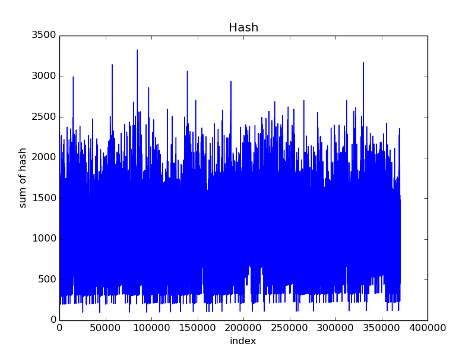
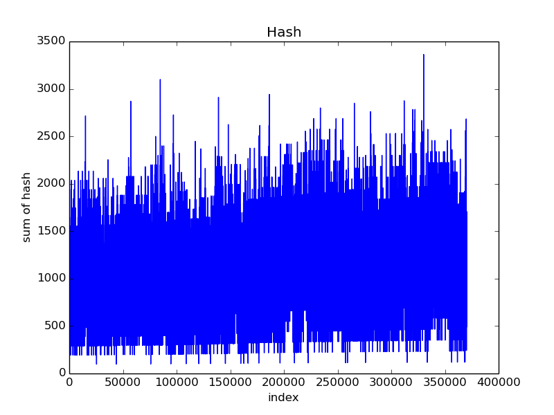

# CSE 109 - Quiz 6

**Due: 3/31/2021 End of Day**

Make at least one commit per question. You can write your answers in this file, `README.md`. You can use the Gitlab interface to edit this file if you prefer.

## Question 1

For this question you can use any tool you like to solve it. Excel and Matlab are good choices. You can use Java, C, C++ or any other language you like.

- Download the dictionary of English words located here: https://github.com/dwyl/english-words/blob/master/words_alpha.txt
- Write a prehash function that maps each letter of the word to its ASCII value, and sums up them up. For example, the word "symbol" maps to the numbers 115, 121, 109, 98, 111, 108; and sums to 662.
- Apply the prehash function to each word in the dictionaty.
- Make a histogram of the prehashes and include it below as a PNG or JPEG. You can render images in markdown with the following syntax: https://www.markdownguide.org/basic-syntax/#images or with an HTML `` tag.

## Question 2

Looking at the histogram, can you say whether or not the prehash function you wrote is a good one for a hash table? What makes it good or bad?
It is not a a good one for a hash table. There are several words have extremly high prehash value(over 3000).It is hard to insert a group of data that some memebers have huge prehash value gaps between each other in a hash table with fixed origin size. For example, a word with 97 prehash value may be stored at bucket 9, but another word with 3500 prehash value may be stored at 350.

## Question 3

Make a modification to the prehash function you wrote such that the value to which the maps is dependant on its position in the word. For example, an "a" as the first character could map to 97, as the second character 194 (97*2), as the third character 291 (97*3) and so on. Recreate the histograph from Question 1 and include it below as a PNG or JPEG.

What has changed between the histograms? Is this new prehash function any more suitable for a hash table? Why or why not?

Even there are still some of them have extremly higher prehash value than others, most of their prehash value are within 2500 and distributed more evenly. Thus, it will be a more suitable than Q1, because it decrease the gaps of prehash values between each word, and they could be fit into hash table more smoothly.